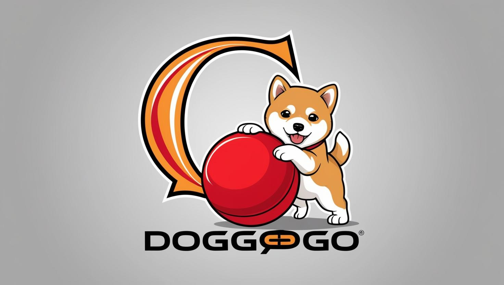

# DoggoGO

by Rankl Manuel, Hoheneder Daniel

## Outline

---
[Project Purpose](1.Purpose.md)

---

1. [Ausgangssituation](3.Ausgangssituation.md)
2. [Rahmenbedingungen und Einschränkungen](4.Rahmenbedingungen_und_Einschränkungen.md)
3. [Projektziele und Systemkonzepte](5.Projektziele_und_Systemkonzepte.md)
4. [Chancen und Risiken](6.Chancen_und_Risiken.md)
5. [Planung](7.Planung.md)
6. [ProductBacklog](8.Product_Backlog.md)