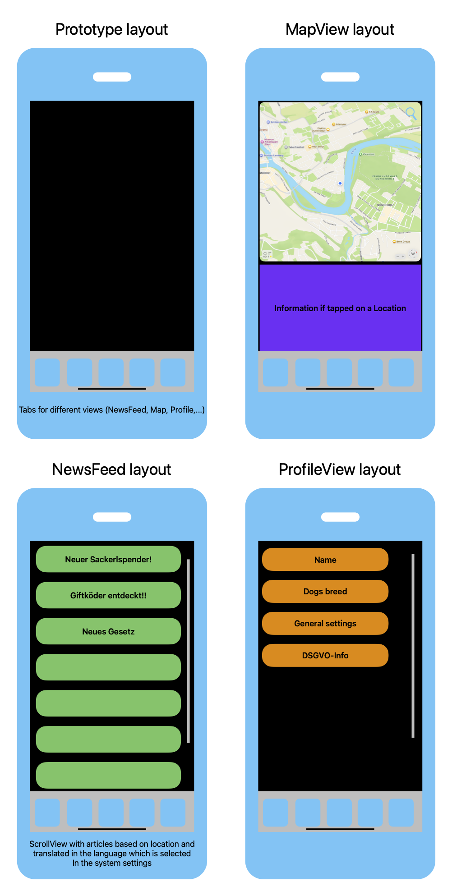

# **Projektziele**

1. **Erleichterung der Hundehalterung**:
   - Die App soll Hundehaltern eine benutzerfreundliche Plattform bieten, um Informationen über geeignete Standorte für Hundeausflüge wie Freilaufwiesen, Hundesackerlspender und spezielle Abfallbehälter schnell und einfach zu finden.
   - Ziel ist es, das Leben der Hundehalter durch einfache, intuitive Navigation und benutzerdefinierte Vorschläge zu verbessern.

2. **Förderung der Einhaltung lokaler Vorschriften**:
   - "DoggoGO" soll Hundehalter über geltende gesetzliche Bestimmungen in ihrer Region informieren, wie Maulkorb- und Leinenpflichten.
   - Ziel ist es, das Verständnis und die Einhaltung dieser Vorschriften zu fördern, um sowohl die Sicherheit der Hunde als auch das Wohl der Gemeinschaft zu gewährleisten.

3. **Verbesserung der Effizienz und Nachhaltigkeit**:
   - Die App soll durch die Bereitstellung von gezielten Informationen, wie den Standorten von Müllbehältern und Hundesackerlspendern, den Verwaltungsaufwand für Gemeinden reduzieren und zu einer besseren Sauberkeit in öffentlichen Bereichen beitragen.
   - Ziel ist es, eine nachhaltigere und umweltfreundlichere Hundehaltung zu fördern.

4. **Zielgruppenspezifische Personalisierung**:
   - Nutzer der App sollen Informationen basierend auf ihrer spezifischen Hunderasse und dem aktuellen Standort erhalten.
   - Ziel ist es, die Relevanz der bereitgestellten Informationen zu maximieren und den Mehrwert der App zu steigern.

5. **Technologische Innovation und Integration**:
   - Implementierung von modernen Technologien wie GPS und Geofencing zur genauen Lokalisierung und Push-Benachrichtigungen über relevante Änderungen in der Umgebung.
   - Ziel ist es, eine nahtlose und effektive Benutzererfahrung zu bieten.

---

## **Systemkonzepte:**

1. **Datenbasis und Informationsmanagement**:
   - **Lokale Geodaten**: Die App verwendet umfassende geographische Datenbanken, um relevante Standorte wie Freilaufwiesen, Hundesackerlspender und Hundekotmülleimer zu identifizieren. Diese Daten werden durch Zusammenarbeit mit lokalen Behörden und Organisationen kontinuierlich aktualisiert.
   - **Gesetzliche Vorgaben**: Einbindung von geographischen Daten zu lokalen Gesetzen und Vorschriften für Hunde. Diese Informationen werden durch offizielle Quellen und Nutzerfeedback gepflegt und angepasst.
   - **Community-Daten**: Integration von Nutzerbewertungen und Erfahrungsberichten zu verschiedenen Standorten und Dienstleistungen für Hundehalter, um die Qualität der Daten zu verbessern.

2. **Benutzeroberfläche und Navigation**:
   - **Interaktive Karte**: Die Hauptfunktion der App ist eine interaktive Karte, die den aktuellen Standort des Benutzers anzeigt und relevante Standorte in der Umgebung markiert. Benutzer können einfach Zoomen, Filtern und nach spezifischen Bedürfnissen suchen.
   - **Such- und Filterfunktionen**: Ermöglichung der Suche nach bestimmten Arten von Freilaufwiesen, Hundeauslaufzonen, oder Abfallbehältern. Filteroptionen basieren auf Kriterien wie der Größe des Hundes oder spezifische Vorschriften in der Region.
   - **Push-Benachrichtigungen**: Automatische Benachrichtigungen zu neuen Einrichtungen, wichtigen Änderungen in den Vorschriften oder Warnungen vor geschlossenen Bereichen.

3. **Personalisierung und Empfehlungssystem**:
   - **Profilverwaltung**: Benutzer können ihr Profil anlegen und ihre Hunderasse und die gewünschten Aktivitäten speichern. Die App nutzt diese Informationen, um maßgeschneiderte Vorschläge zu machen, wie z. B. geeignete Freilaufwiesen oder lokale Dienstleistungen.
   - **Algorithmus für Empfehlungen**: Nutzung von Algorithmen zur Vorhersage und Empfehlung von Standorten basierend auf historischen Daten und Nutzerverhalten.
   - **Feedback und Verbesserung**: Integrierte Funktion zur Abgabe von Feedback und zur Meldung von neuen Standorten oder Missständen, die die Qualität der Daten verbessern.

4. **Technologische Basis**:
   - **Mobile Apps**: Entwicklung von nativen Apps für iOS und Android, um eine breite Nutzerbasis zu erreichen.
   - **Serverinfrastruktur**: Implementierung einer skalierbaren Serverlösung für Datenmanagement und Benachrichtigungssysteme.
   - **Cloud-Dienste**: Nutzung von Cloud-Plattformen für Speicherung und Verarbeitung von Nutzerdaten sowie zur Integration von Drittanbieter-Services.

5. **Zukunftsfähigkeit und Erweiterbarkeit**:
   - **Regelmäßige Updates**: Regelmäßige Aktualisierungen der App, um neue Funktionen, regionale Erweiterungen und verbesserte Benutzererfahrungen zu integrieren.
   - **Skalierbarkeit**: Die App muss flexibel sein, um neue Standorte und Funktionen wie z. B. den Verkauf von Premium-Funktionen oder interaktive Social-Features für Hundebesitzer zu integrieren.

---

## UI-Konzept:

